# Version Control via Git and Github
*Tutorial to introduce major concepts of using Git and hosting on Github. No command line skills needed.*

**Before this lesson**:

*  Obtain a Github account. If you sign up using a student email you get five free private repositories through the [student developer pack](https://education.github.com/pack).
*  Install Github GUI. [Github GUI Guide (Mac)](https://mac.github.com), [Github GUI Guide (Windows)](https://windows.github.com).  *Unfortunately, the GitHub GUI may not be available for everyone.  A great alternative GUI is [Source Tree](https://www.sourcetreeapp.com/)*

**After this lesson, you should be able to**:

*   Initiate Git in a local project directory.
*   Evaluate repository History.
*   Know the difference between directory and repository.
*   Commit changes to files.
*   Push local repository to remote repository on Github.
*   Clone a remote repository.
*   Create a pull request to someone else's remote repository.
*   Differentiate between a local and remote repository.  

## I. Git Locally (on your computer)

With Git comes many strong opinions on the best practices of how to use Git. 
The truth is Git can be really straight forward to use and best practices 
only make sense and develop once you start using it. So let's Git started!

**Goal**: To initiate and make commit on a local directory (folder on your computer).

###Outline

1. Initiate Git in a Directory
2. Commit
3. Changing files
4. "Rolling Back" into the past

### I. Step 1: Initiate Git in a Directory (`git init`)

Find your `lit-prog` directory, which may already be on your computer 
from the organization lesson. Open the GitHub GUI.  
Click the `+` in the top left corner of the screen, choose `add`, and 
either enter the path to the `lit-prog` or click `choose` to find 
the folder on your computer.  To complete click `create and add repository`.

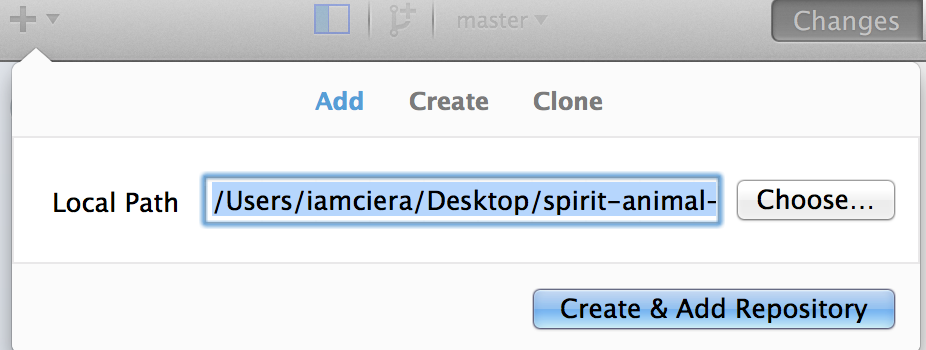

Now you have initiated Git into that directory you have created 
a `Git repository`, which is a directory that is now being 
tracked by Git software. It is tracked through a hidden 
file called `.git` within the directory you added. 

### I. Step 2: Commit (`git commit`)

At this point we have just initiated Git within the `lit-prog` 
directory.  You can see in the "History" tab that this 
repository has no history.  History only begins by making 
a **commit**.  Git is all about composing and saving snapshots 
of your project and then working with and comparing those 
snapshots. A commit is taking a snapshot, while attaching 
a little note to help you understand that point in history of your
project. You can look in the "Changes" tab and see all four files and 
a lot of green lines. Our first commit is adding everything in the 
directory.

Let's go ahead and make a commit. All you have to do is 
add a message that describes your commit and press "Commit to master". 

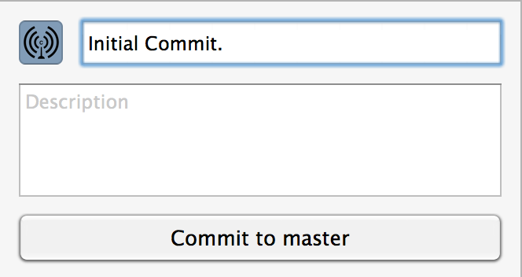

Now if you see that "Changes" tab is blank and if 
you look at "History", you can view your first commit. 

*tip*: There are many best practices of committing.  
The best advice is: Commit early and often. Then strive to 
describe your commit concisely, but with meaning. You want to 
be able to understand exactly what point of history in the future.

### I. Step 3: Changing files (`git diff`)

Open up the `countryPick4.Rmd` and add your name to the YMAL 
front matter at the top of the document, then Save.

    ---
    title: "Pick four - comparing trends in population  over time"
    output: pdf_document
    Author: Ciera Martinez
    ---

Now if you look at the "Changes" tab you can see that the line 
I just added is clearly displayed in green.  You may also notice 
that there are no other files present since we did not change 
anything else. 

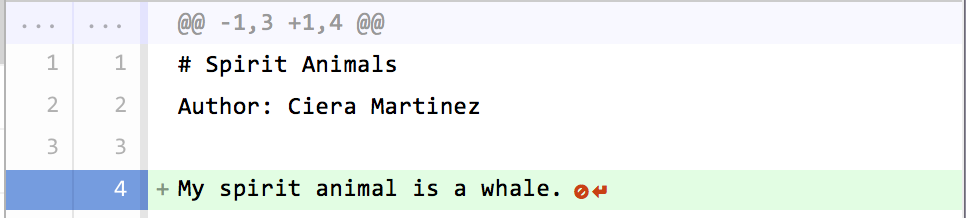

Go ahead and commit this change and give the commit a good message.

### **On your own**: 

1.) Update the `countryPick4.Rmd` with the date and commit this change.

    ---
    title: "Pick four - comparing trends in population  over time"
    output: pdf_document
    Author: Ciera Martinez
    Date: June 2, 2015
    ---

2.) Add your name to the top of the `README.md` file and commit this change.

    #Files for the Literate Programming lesson
    *Modified by Ciera Martinez*

### I. Step 4: "Rolling Back" into the past (`git reset`)

Now that you have a small history, let's go back in time. 
**"Rolling back" (`git reset`)** creates a new commit 
that reverts the changes of the commit you choose.  

You can rollback to a single commit by clicking on the 
commit you would like to go back to and selecting 
“Rollback to this commit”. 

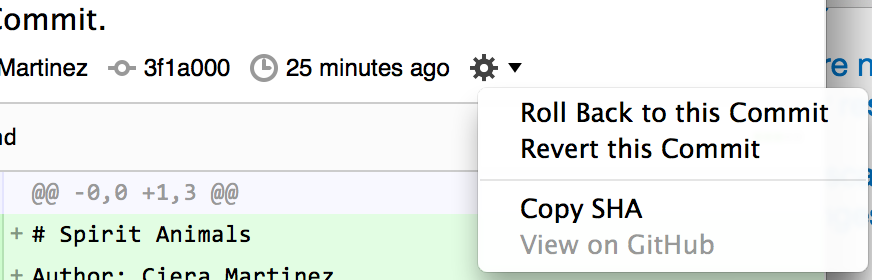

Try rolling back to your first commit and viewing your 
`countryPick4.Rmd` file.  You can see that that file 
is now in the state when you made your first commit. 

Rolling back will leave the original commit in the 
repository's history, so you can always revert a 
revert if necessary and never lose any commits.  Do 
this on your "Added Date Line" commit to get back to where 
we were by "Rolling back" to the commit where you added your name 
to `README.md`.

**Tip:** If you are going to use the Github GUI, only use 
the Rollback option, don't use revert. Things can get really 
confusing fast. I highly recommend messing around with it 
further on a folder you are not concerned with or begin using 
command line git to have more control.  Also, there is an "undo" 
option in the "changes" tab if your git history gets confusing, 
but there is a general rule to never rewrite your git history 
*especially* if you are collaborating or have already 
published/hosted your code on-line. 

## II. Git Remotely: Hosting on Github (`git push`)

**Goal**: Host local repository on Github.

###Outline
1. Log in to Github and create a repository 
2. Connect the your local and remote repositories
3. Cloning other repositories and collaborating 

### II. Step 1: Log in to Github and create a repository 

Log into your browser, then click on the icon in the top right corner 
to create a new repository.

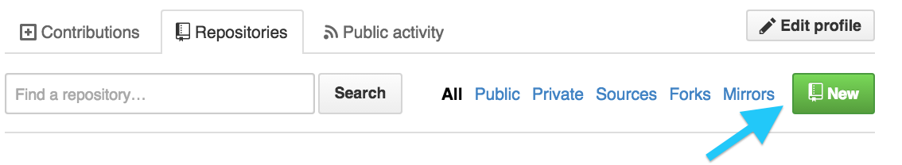

Name it `lit-prog-firstName-lastName`. For example, `lit-prog-ciera-martinez`. 
Then click "Create Repository".

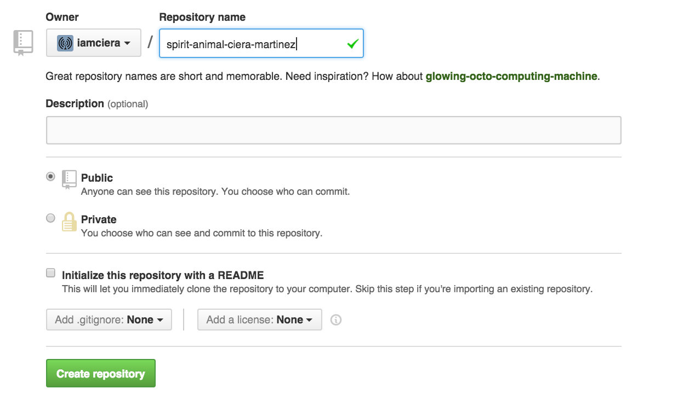

As soon as the repository is created,
GitHub displays a page with a URL and some information on how to 
configure your local repository.

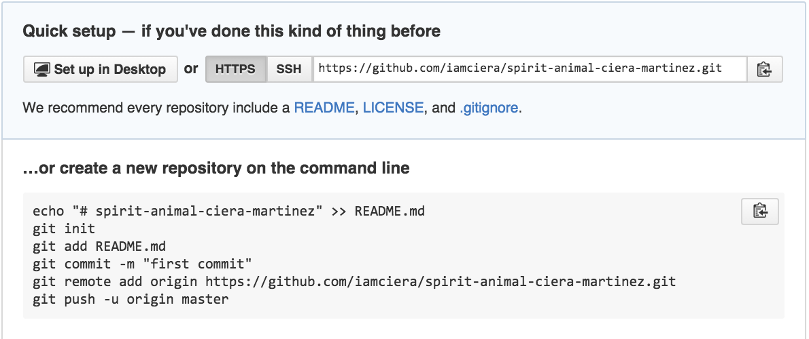

Copy the HTTPS text line: example `https://github.com/iamciera/lit-prog-your-martinez.git`

### II. Step 2: Connect the your local and remote repositories

Connect your local repository and the newly created remote repository on Github. 
First, login to your Github account in the Github GUI from File > Preferences > Accounts. 

Now we need to make our GitHub repository a remote for the local repository. 
Go back to the GitHub GUI and click "Publish" in the top right hand corner. 

The home page of the repository on GitHub includes the string we need to 
identify it.  Go to Repository > Repository Settings, click "remote" and 
paste in the HTTPS address.  And click "Publish" in the top right corner. 

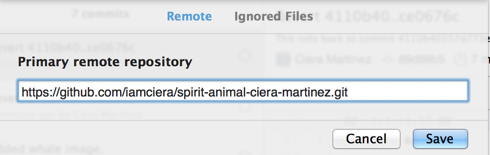

If you go back to your browser and press refresh, all your files should be there on Github!  

## III. Git Remotely: Cloning Others Repos (`git clone`) and Collaborating 

One of the most powerful aspects of using git is for multiple people to work on 
a single project together. Many of you may be aware of the struggles of 
emailing many drafts of a single document to people on your team. 
By the time you get back edits from one person, the document from the other 
is already outdated. So you spend a lot of time re-reading what is new and what is old.
While these types of problems can be overcome using a service like Google Drive, on a 
project with multiple files, organization becomes confusing fast. 

**Goal**: Make changes to someone else's Github repository.

### Outline of Collaborating through Github

1.  Get a copy of a project by `fork`ing the original repository to your remote server. 
2.  `clone` your forked repository locally. 
3.  Make any changes. Commit changes.
4.  "Publish" / `push`changes to your remote server.
5.  Ask to merge your changes to the original project by creating a pull request.
6.  Owner of the original repository checks your changes and merges your changes into the repository by accepting the pull request.

### III. Step 1: Forking a repository

For this exercise, team up with one other person. This tutorial is written from my (@iamciera) perspective, 
my partner is Saul Goodman (@saulGoodmanNM).  I will be making changes to their repository 
repository and they will be making changes to yours. 

First find your partners repository by searching for their @name in the search bar at the top 
left of your Github home page. Click on their `lit-prog` repository. 

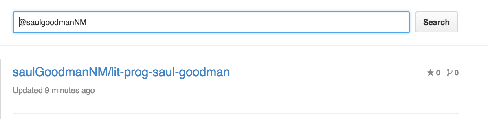

Notice that repositories on Github are categorized by user/repositoryName and every repository has a unique
address on Github. Saul's is 
[github.com/saulGoodmanNM/lit-prog-saul-goodman](https://github.com/saulGoodmanNM/lit-prog-saul-goodman). 
Once there, click the "fork" button on the top left of the screen. 

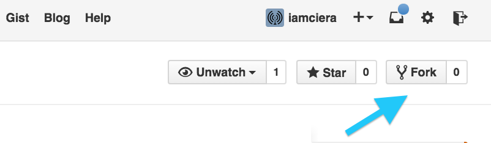

Now you should have your own version of your partners repository to do 
whatever you want with it! You can do this with anyone's public project! 
Build upon any work that is out there! This is the beauty of open source.
Anyway, notice that you have now made a copy of your partner's repository and it
now has a unique id.  My forked copy of Saul's repository is located at
[github.com/iamciera/lit-prog-saul-goodman](https://github.com/iamciera/lit-prog-saul-goodman).

**Tip**: I highly recommend looking around at cool projects on Github, 
forking them, and messing with the code to build something new.  Great learning resource.

### III. Step 2: Cloning a Repository (`git clone`)

While forking is copying someone's repository to your remote server, cloning is 
putting all the files in the repository directly onto your local computer.  
You can directly clone someone's repository without forking, but it is best practice 
to fork first. Also, you do not have permission to "publish" / push to their repository.

So let's clone the recently forked repository. Make sure that you are cloning the forked 
copy.  Check and make sure that your name should be in the top left hand corner of 
the repository page. Cloning is easily accomplished by clicking the "Clone in Desktop" 
button on the right side bar on the repository page. 

Now choose a location to put the repository on your computer and click "clone".  
Depending on the size of the repository, this can take some time, but these small 
repositories should clone fast. 

**Tip**:  Where you put your cloned repo is up to you.  Many people try to keep their
repositories in one place. For example, I keep most of my git repositories in a directory
called `git.repos`.

### III. Step 3: Making Changes

Now that we have a copy on our computer, let's add something to the file. Add your name to the top of the 
'README.md' file along with the one sentence about your research. Example: 

    #Files for the Literate Programming lesson
    *Modified by Saul Goodman*

    *Also Modified by Ciera Martinez: I research the evolution and development of plant shape.

Commit this change and "Publish" / push back to *your* remote repository.

### III. Step 4: Creating a Pull Request

The last step on your end is sending your changes to the original owner of the repository by 
creating a pull request.  Go to the repository page you just pushed to 
(ex. github.com/iamciera/lit-prog-saul-goodman)
and click the pull request button.  This is the green button with two arrows near 
the name of the repository.  

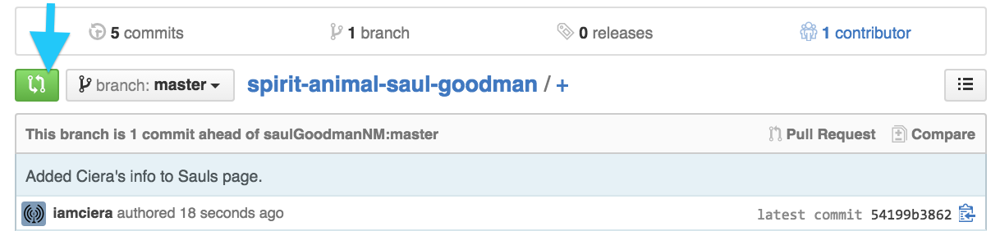

You should see the exact change to the file you performed.  Go ahead and proceed by 
clicking the green "create pull request".

### III. Step 5: Accepting a Pull Request

All that is left is accepting the pull request that has been sent to you requesting changes 
to your original repository. Go to your original repository, if everything went 
well on your partner's side, on the left side bar you can see that you have one pull request, 
click on the tab. You can see what your partner wants to add and if it looks good, "merge pull request".  
You can add a commit to discuss the changes here also. 

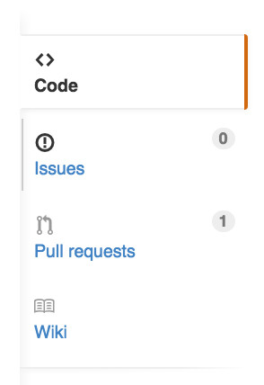

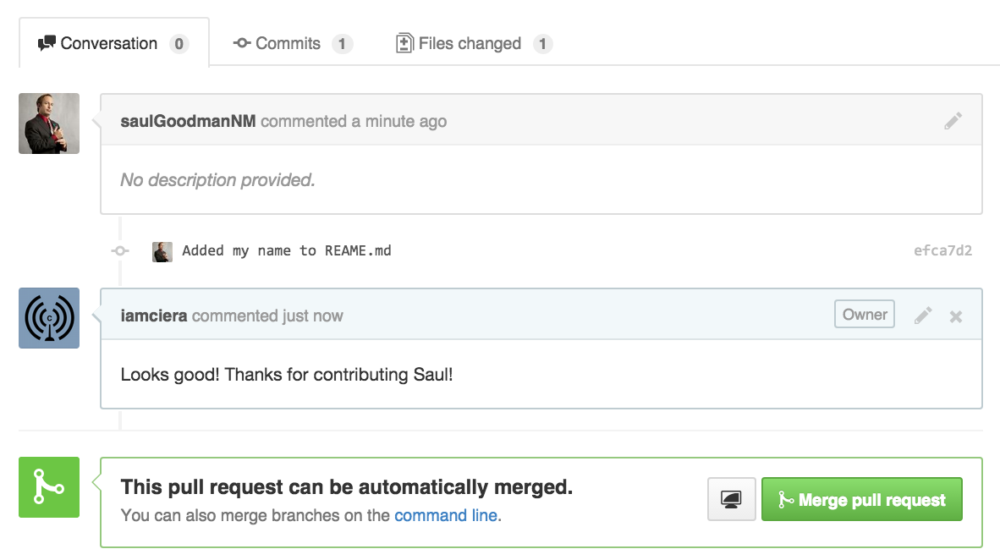

### IV. More information:

**Practice**:It may take a few times to get used to all the changes, so I highly encourage you to keep practicing.  
Find and create projects that allow a non-judgmental way to practice. Ask your partner if you can 
continue practicing with them using this already established repository. Here are a few other repositories that 
encourage practicing:

-   [https://github.com/TheCodingCollective/quotes](https://github.com/grayghostvisuals/Practice-Git): This is a repository I started to help people practice, it is just a single file where people add their favorite quotes. 
-  [https://github.com/grayghostvisuals/Practice-Git](https://github.com/grayghostvisuals/Practice-Git):  This is just do whatever you want repository. Get creative.
-   [https://bitbucket.org/tutorials/tutorials.bitbucket.org](https://github.com/grayghostvisuals/Practice-Git): This is part of a Bitbucket tutorial, where you can also add quotes.
 
**Branching**:  We never discussed branching, but this is a powerful way to organize your workflow.
Today, we just stayed on the master branch. Most people make commits and work on an alternative branch, 
many times called the `dev` brnach.  There are many reasons to not work on the master branch, as discussed 
[here](http://stackoverflow.com/questions/5713563/reasons-for-not-working-on-the-master-branch-in-git).  
If you are new, I recommend working on the master branch only until you get the hang of things.

**Best practices for collaborating** Best practices on collaborating 
with Git can vary widely.  If you want to start contributing to a Git repository, 
often times you can find rules for in a file called `CONTRIBUTING.md`. A popular workflow is 
[GitFlow](https://datasift.github.io/gitflow/IntroducingGitFlow.html).

**Conflicts**:  Conflicts are the biggest pain in while using Git.  They occur when you try to put two conflicting
text in the same spot.  There is no easy way to get into understanding conflicts, but here are 
some resources for conflict trouble shooting 
[Resolving conflict in GitHub GUI](https://help.github.com/articles/resolving-merge-conflicts/) and
 [Command Line Software Carpentry article](http://swcarpentry.github.io/git-novice/09-conflict.html).

### A note about Git command line

The Github GUI is nice, but I highly recommend using Git on command line. 

*   If you are unfamiliar with Unix, using command line Git is a great project to get more familiar with more Unix and Git. 
*   Most people are using command line git, so getting help with problems is ALOT easier. 
*   There are features in command line that are not available in the GUI. 
*   Git is a marketable skill, if you choose to pursue any job in industry, they will expect you to know command line Git. 
*   If you started with using the GUI and want to start using command line, no problem, your git history will not change.  

## Resources

-   [Github GUI Guide (Mac)](https://mac.github.com/help.html)
-   [Github GUI Guide (Windows)](https://windows.github.com/help.html)
-   [Bitbucket](https://bitbucket.org/) - alternative to Github hosting. Unlimited free 
 
### Examples of code from research papers on Github

-   [https://github.com/tessington/PNASForageFish](https://github.com/tessington/PNASForageFish)
-   [https://github.com/seananderson/paleobaselines/](https://github.com/seananderson/paleobaselines/)

### Best Practices

-   [Nice Overview of Best Practices](https://sethrobertson.github.io/GitBestPractices/)
-   [Git Flow CheatSheet](http://danielkummer.github.io/git-flow-cheatsheet/)

## Attribution and Licenses

This material is dedicated to the public domain under the 
[CC Zero](https://creativecommons.org/publicdomain/zero/1.0/) waiver.

