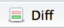

# Overview

## RStudio and version control

RStudio includes integrated support for two open source version control systems:

- Git
- Subversion

For this lesson we will focus on Git.

## Two requirements

1. Install Git (you should have already done this)

2. Be familiar with using RStudio Projects, which are required for version control features to be enabled
    - RStudio projects make it straightforward to divide your work into multiple contexts, each with their own working directory, workspace, history, and source documents.

# Step-by-step

## Follow along demo

**Step 1:** Fork the [`rr-version-control-demo`](https://github.com/Reproducible-Science-Curriculum/rr-version-control-demo) repository.

**Step 2:** Clone your forked repository to obtain a local copy of the files into an RStudio project.

**Step 3:** Edit a file in this repository/project.

**Step 4:** Stage your changes to be committed.

**Step 5:** View the diff, and commit your changes, with a commit message.

**Step 6:** Push your changes to your own fork of the the `rr-version-control-demo` GitHub repository.

## Step 1: Fork

**Fork the [`rr-version-control-demo`](https://github.com/Reproducible-Science-Curriculum/rr-version-control-demo) repository.**

 

1. Go to the repository at https://github.com/Reproducible-Science-Curriculum/rr-version-control-demo.
2. Click on Fork (on the top right corner).

  

*Now you have a copy of `rr-version-control-demo` repository in your account, woohoo!*

## Aside: Where am I?

**How can I tell if I am looking at my fork or the original repository?**

- Look at the URL.
- Look at the name of the repo on the upper left corner, for your fork it will say:

~~~
[your-github-name]/rr-version-control-demo
forked from Reproducible-Science-Curriculum/rr-version-control-demo
~~~

## Step 2: Clone

**Clone your forked repository to obtain a local copy of the files .**

 

1. In RStudio, go to File, and then New Project
2. Click on *Version Control: Checkout a project from a version control repository*
3. Click on *Git: Clone a project from a repository*
4. Fill in the info:
    - URL: use HTTPS address
    - Create as a subdirectory of: Browse to where you would like to create this folder
        
        
## Step 3: Edit

**Edit a file in this repository/project.**

 

1. Open the file called `gdp-life-expectancy.Rmd` and knit.
2. Change the `analysis_year` to another year for which we have data, and knit again. Examine the output for changes.

## Step 4: Stage

**Stage your changes to be committed.**

 

1. Go to the Git pane in RStudio.
2. Stage the changes for `gdp-life-expectancy.Rmd` and `gdp-life-expectancy.html` by checking the boxes next to then, and hit Commit.

  

*Don't worry about the other files that appear in this pane, we'll get to them in a bit.*

## Step 5: Commit

**View the diff, and commit your changes, with a commit message.**

 

1. In the pop-up window view the *diff* for the Rmd file. You can view it for the HTML file as well if you like.
2. Enter an **informative** commit message, like "Changed analysis year to X", and hit Commit.

## Step 6: Push

**Push your changes to your own fork of the the `rr-version-control-demo` GitHub repository.**

 

1. Now push your changes to GitHub by hitting Push.
2. Enter login information as needed.

  

*Getting an error? Can't push? See [here](https://github.com/jennybc/stat540_2014/blob/master/seminars/seminar92_git.md) under GitHub password. Ask a helper!*

# Other day one essentials

## More info on the Git pane

File tracking:

- The RStudio Git pane lists every file that’s been added, modified or deleted. 

- The icon describes the change:
    +  **Modified:** You've changed the contents of the file.
    +  **Untracked:** You've added a new file that Git hasn't seen before.
    +  **Deleted:** You've deleted a file.

You can get more details about modifications with a :

- Green: added text

- Red: removed text

## What's in my Git pane?

- When you cloned your repo into an RStudio project you got two bonus files that weren't there before: `.gitignore` and `.rr-version-control-demo.Rproj`

- They're both showing up as **untracked** since Git hasn't seen them before. You can stage, commit, and push those files to your repository.

- `.rr-version-control-demo.Rproj`: This file maintains metadata on the R project.

- `.gitignore`: Git uses this file to determine which files and directories to ignore, before you make a commit.